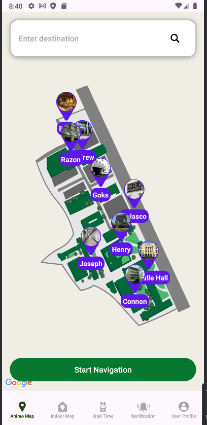
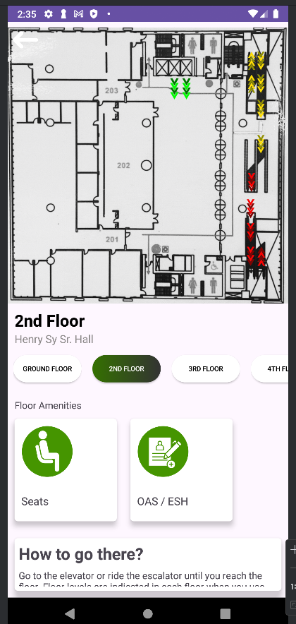
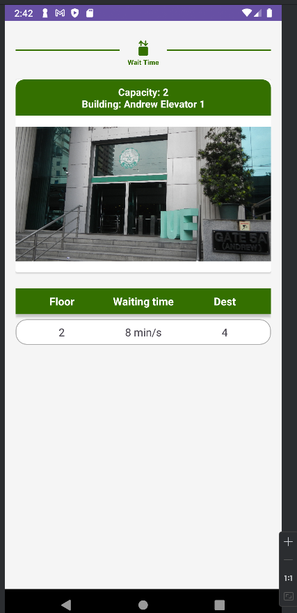

# De La Salle University Campus Navigator (Animo Map)

An Android application inspired by the Universal Studios app, tailored to enhance the campus experience at De La Salle University (DLSU). This app provides interactive maps, indoor navigation, real-time elevator wait times, and timely notifications from the DLSU help desk.

## Features

- **Interactive Campus Map**: Navigate the DLSU campus with ease using a detailed, interactive map powered by Google Maps API.
- **User Profile Management**: Create and manage personal profiles for a personalized experience.
- **Authentication**: Secure login and registration system to protect user data.
- **Indoor Navigation**: Find your way inside campus buildings with step-by-step directions.
- **Elevator Wait Times**: Access real-time information on elevator availability and wait times.
- **Help Desk Notifications**: Receive important announcements and updates directly from the DLSU help desk.

## Screenshots


*Profile Account*



*Interactive Campus Map*



*Indoor Navigation Feature*



*Elevator Waiting Time*

## Installation and Setup

1. **Clone the Repository**:
   ```bash
   git clone https://github.com/rnzbobi/MOBDEVE.git
   ```

2. **Open in Android Studio**:
   - Launch Android Studio.
   - Navigate to **File > Open** and select the cloned project directory.

3. **Configure Google Maps API**:
   - Obtain an API key from the [Google Cloud Console](https://console.cloud.google.com/) by enabling the following APIs:
     - Maps SDK for Android
     - Directions API
     - Places API
     - Geolocation API
     - Autocomplete API
   - Add the API key to `MainActivity.java`:
     ```java
     // MainActivity.java
     private static final String MAPS_API_KEY = "YOUR_API_KEY_HERE";
     ```
   - Also, include the API key in the `AndroidManifest.xml`:
     ```xml
     <!-- AndroidManifest.xml -->
     <meta-data
         android:name="com.google.android.geo.API_KEY"
         android:value="YOUR_API_KEY_HERE"/>
     ```

4. **Build and Run the Application**:
   - Ensure your development environment meets the [system requirements](https://developer.android.com/studio#system-requirements).
   - Connect an Android device or set up an emulator.
   - Click on the **Run** button in Android Studio to build and deploy the app.

## Dependencies

- Android SDK
- Google Maps Services
- Firebase Authentication
- Retrofit for API calls

## Contributing

We welcome contributions to enhance the app's functionality and user experience. To contribute:

1. Fork the repository.
2. Create a new branch: `git checkout -b feature/YourFeatureName`.
3. Make your changes and commit them: `git commit -m 'Add some feature'`.
4. Push to the branch: `git push origin feature/YourFeatureName`.
5. Submit a pull request detailing your changes.

## License

This project is licensed under the MIT License. See the [LICENSE](LICENSE) file for details.

## Acknowledgements

Special thanks to the developers of the Universal Studios app:

RHENZ BHOVIE O. VILORIA
STEVEN CHARLES K. YU
EMMANUEL ANDREW TING
ACEMERE F. VILLENA


---

*Note: This application is a project developed for educational purposes and is not officially affiliated with De La Salle University.* 
